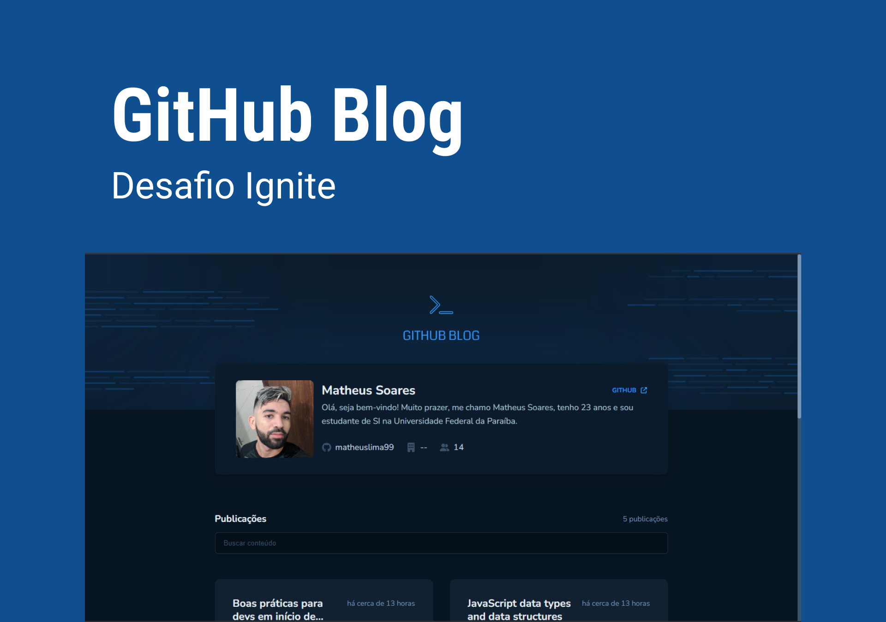

<div id="top"></div>

<!-- PROJECT LOGO -->
<br />
<div align="center">
  <a href="https://github-blog-sigma.vercel.app/" target="_blank" >
    
  </a>

  <h3 align="center">Github Blog</h3>

  <p align="center">
   Uma aplicação web que utiliza a API do GitHub para buscar issues de um repositório, dados do perfil e exibi-los como um blog.
    <br />
    <br />
    <a href="https://github-blog-sigma.vercel.app/" target="_blank" >View Demo</a>
    ·
    <a href="https://github.com/matheuslima99/github-blog/issues">Report Bug</a>
    ·
    <a href="https://github.com/matheuslima99/github-blog/issues">Request Feature</a>
  </p>
</div>

<!-- TABLE OF CONTENTS -->
<details>
  <summary>Table of Contents</summary>
  <ol>
    <li>
      <a href="#sobre-o-projeto">Sobre o projeto</a>
      <ul>
        <li><a href="#construído-com">Construído com</a></li>
      </ul>
    </li>
    <li>
      <a href="#começando">Começando</a>
      <ul>
        <li><a href="#instalação">Instalação</a></li>
      </ul>
    </li>
    <li><a href="#contribuindo">Contribuir</a></li>
    <li><a href="#licença">Licença</a></li>
    <li><a href="#contato">Contato</a></li>
  </ol>
</details>

<!-- ABOUT THE PROJECT -->

## Sobre o projeto

 <a href="https://github.com/matheuslima99/github-blog">
    
  
  </a>

O Github blog é uma aplicação web que tem como objetivo buscar os dados de um determinado usuário
do Github e exibi-los como um blog, além de mostrar com mais detalhes as issues presentes neste mesmo
repositório da aplicação no Github, permitindo também a pesquisa por issues específicas.

<p align="right">(<a href="#top">back to top</a>)</p>

### Construído com

- [Typescript](https://www.typescriptlang.org/)
- [React.js](https://reactjs.org/)
- [Vite](https://vitejs.dev/)
- [Font Awesome](https://fontawesome.com/)
- [React Hook Form](https://react-hook-form.com/)
- [React Router Dom](https://reactrouter.com/en/main)
- [React Markdown](https://remarkjs.github.io/react-markdown/)
- [date-fns](https://date-fns.org/)
- [Zod](https://github.com/colinhacks/zod)
- [Axios](https://axios-http.com/)

<p align="right">(<a href="#top">back to top</a>)</p>

<!-- GETTING STARTED -->

## Começando

Você precisa ter o NodeJs instalado

### Instalação

1. Clonar o repositório
   ```sh
   git clone https://github.com/matheuslima99/github-blog
   ```
2. Instalar pacotes NPM
   ```sh
   npm install
   ```
3. Para executar no seu dispositivo

   ```sh
   npm run dev
   ```

<p align="right">(<a href="#top">back to top</a>)</p>

<!-- CONTRIBUTING -->

## Contribuindo

As contribuições são o que tornam a comunidade de código aberto um lugar tão incrível para aprender, inspirar e criar. Quaisquer contribuições que você fizer são muito apreciadas.

1. Fork do Projeto
2. Crie sua ramificação de recursos (`git checkout -b feature/AmazingFeature`)
3. Confirme suas alterações (`git commit -m 'Add some AmazingFeature'`)
4. Empurre para a Branch (`git push origin feature/AmazingFeature`)
5. Abra uma Pull Request

<p align="right">(<a href="#top">back to top</a>)</p>

<!-- LICENSE -->

## Licença

Distribuído sob a licença MIT. Ver `LICENSE.txt` para maiores informações.

<p align="right">(<a href="#top">back to top</a>)</p>

<!-- CONTACT -->

## Contato

Matheus Lima - [LinkedIn](https://www.linkedin.com/in/matheus-soares99/) - maths.soares99@gmail.com

Link do projeto: [https://github.com/matheuslima99/github-blog](https://github.com/matheuslima99/github-blog)

<p align="right">(<a href="#top">back to top</a>)</p>
